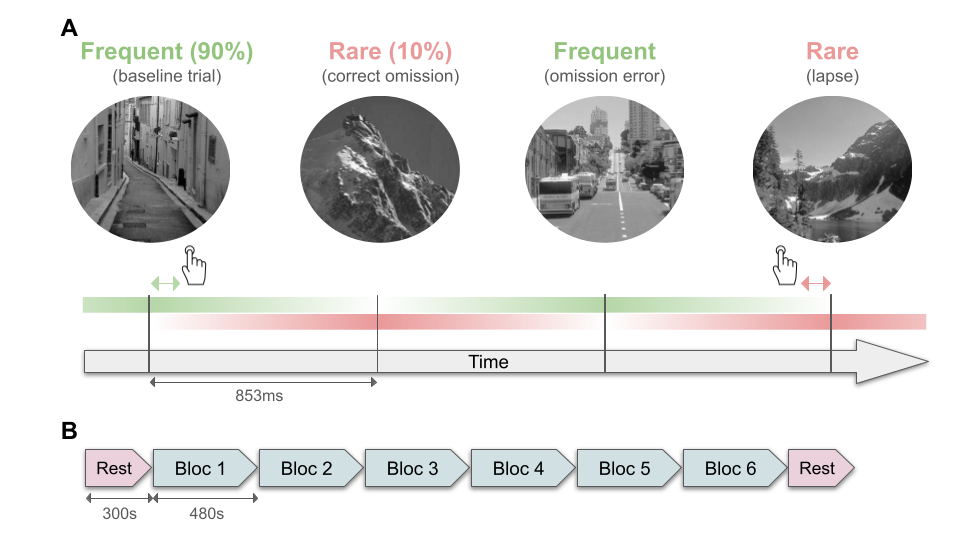

# Saflow: MEG Analysis Pipeline for GradCPT Task

A production-ready, config-driven MEG analysis pipeline for processing gradual continuous performance task (gradCPT) data across sensor, source, and atlas analysis spaces.

**Version**: 0.2.0
**Status**: Active Development
**Python**: 3.11-3.12

---

## Table of Contents

- [Overview](#overview)
- [Dataset Specificities](#dataset-specificities)
- [VTC Framework](#vtc-framework)
- [Pipeline Architecture](#pipeline-architecture)
- [Installation](#installation)
- [Pipeline Workflow](#pipeline-workflow)
- [Design Choices](#design-choices)
- [Usage Examples](#usage-examples)
- [Configuration](#configuration)
- [Contributing](#contributing)
- [Known Issues](#known-issues)

---

## Overview

Saflow implements a complete MEG analysis pipeline for the gradCPT (gradual Continuous Performance Task), a sustained attention task designed to study attentional lapses and fluctuations in cognitive engagement. The pipeline supports analysis at three levels:

- **Sensor level**: MEG channel data (~270 channels)
- **Source level**: Cortical surface vertices (~15k vertices)
- **Atlas level**: ROI-averaged parcellations (~80-150 ROIs)

### Key Features

- ✅ **BIDS-compliant** data organization and derivatives
- ✅ **Unified architecture** - same code works across all analysis spaces
- ✅ **VTC-based trial classification** - separate trials by attentional state
- ✅ **Config-driven** - no hardcoded paths, fully reproducible
- ✅ **Comprehensive logging** - provenance tracking with git hash
- ✅ **HPC-ready** - SLURM job arrays + afterok aggregators
- ✅ **Two-pass preprocessing** - ICA + AutoReject with aggregate QC reports
- ✅ **Group statistics** - paired t-tests with tmax/FDR/Bonferroni corrections
- ✅ **Classification** - single-feature, multi-feature (4 axes), and Yeo-network-restricted
- ✅ **Composite figures** - paper-ready stats+classif panels, FOOOF spectral decomposition, network story panels
- ✅ **Modern Python** - type hints, dataclasses, invoke task runner

---

## Dataset Specificities

### GradCPT Task

The **gradual Continuous Performance Task (gradCPT)** is a sustained attention task where participants monitor a continuous stream of city and mountain scenes, responding only to cities (target stimuli) while withholding responses to mountains (non-target stimuli).



**Figure 1. Gradual onset Continuous Performance Task (gradCPT).** **A** Sequence of four consecutive trials illustrating the four possible types of events: baseline trials, correct omissions, omission errors and lapses. The hand icon represents the occurrence of a response, and the nearby arrows show its association with the closest trial. The green and red horizontal bars represent the intensity of each stimulus at every time point, going from 0% (white) to 100% (green or red) and then to 0% again. **B** Experiment structure. The session was split into 8 runs, starting with an eyes-open resting state followed by 6 blocks of the task, and ending with a second resting state.

**Key characteristics**:
- **Gradual transitions**: Scenes morph gradually between cities and mountains over ~850ms
- **Sustained attention**: 8 minutes per run, 6 runs per session
- **Two trial types**:
  - **Frequent (non-target)**: Mountains (90% of trials)
  - **Rare (target)**: Cities (10% of trials)
- **Performance metrics**: Commission errors (lapses), omission errors, reaction times

### Epoch Timing

Epochs are defined relative to stimulus event markers (t=0 = stimulus onset at 0% intensity):

```
                                     ● 100%
                                    / \
                                   /   \
                                  /     \
                                 /       \
                                /         \
                          50%  ●           ●  50%
                              /             \
                             /               \
                            /                 \
                           /                   \
                     0%   ●                     ●   0%
  ────────────────────────┴─────────────────────┴───────────── time
                          ↑    ↑           ↑
                         t=0  tmin        tmax
```

- **t=0**: Event marker at stimulus onset (0% intensity, start of fade-in)
- **tmin (0.426s)**: Epoch starts at 50% intensity (rising phase)
- **midpoint (0.852s)**: 100% stimulus intensity (peak visibility)
- **tmax (1.278s)**: Epoch ends at 50% intensity (falling phase)
- **Duration**: ~852ms, capturing the high-visibility portion of stimulus presentation

These values are configurable in `config.yaml` under `analysis.epochs`.

### Why GradCPT?

Traditional CPT tasks use abrupt scene changes, making it difficult to separate perceptual from attentional effects. The gradCPT's gradual transitions:
1. Minimize low-level visual transients
2. Allow continuous tracking of attention
3. Enable trial-by-trial attentional state estimation via **VTC** (see below)

### Dataset Composition

- **32 subjects** (healthy adults, ages 18-35)
- **6 task runs** per subject (~8 min each, ~48 min total)
- **1 rest run** per subject (eyes open, 5 min)
- **1 empty-room recording** per session (for noise covariance)
- **CTF MEG system**: 275 channels (272 axial gradiometers + 3 reference)
- **Sampling rate**: 1200 Hz native, resampled to 600 Hz during preprocessing

---

## VTC Framework

### What is VTC?

**VTC (Variability Time Course)** quantifies trial-by-trial fluctuations in reaction time variability as a proxy for attentional state. It's computed from behavioral data and used to classify trials into attentional zones.

### Theoretical Foundation

Research shows that:
- **Stable attention (IN zone)**: Low RT variability, fast and consistent responses
- **Fluctuating attention (OUT zone)**: High RT variability, lapses and mind-wandering

VTC provides a **continuous, data-driven measure** of attentional engagement that doesn't rely on subjective reports.

### VTC Computation Pipeline

1. **Load behavioral data** (`.mat` logfiles with trial-by-trial RTs)
2. **Compute raw VTC**: `VTC_raw = |RT - mean(RT)| / std(RT)` (z-scored deviation)
3. **Smooth VTC**: Apply Gaussian filter (FWHM = 9 trials) to reduce noise
4. **Classify trials by percentiles**:
   - **IN zone**: VTC < 25th percentile (stable attention)
   - **OUT zone**: VTC ≥ 75th percentile (fluctuating attention)
   - **MID zone**: Between thresholds (excluded from IN/OUT comparisons)

### Why This Matters

VTC-based trial classification enables:
- **State-dependent analyses**: Compare neural activity during stable vs. fluctuating attention
- **Individual differences**: Each subject's IN/OUT thresholds are personalized
- **Avoid information leakage**: VTC computed during BIDS conversion (Stage 0), thresholds fixed for all downstream analyses

### Configuration

VTC parameters are set in `config.yaml`:
```yaml
behavioral:
  vtc:
    window_size: 20              # Trials for mean/std computation
    filter:
      type: "gaussian"           # Filter type
      gaussian_fwhm: 9           # Full-width half-max (trials)

analysis:
  inout_bounds: [25, 75]         # Percentile thresholds (default: quartiles)
```

Alternative bounds:
- `[50, 50]`: Median split (IN = below median, OUT = above median)
- `[10, 90]`: Conservative (extreme states only)
- `[33, 67]`: Tercile split

---

## Pipeline Architecture

### Unified Multi-Space Design

Saflow uses a **space-agnostic architecture** where the same code processes sensor, source, and atlas data:

```python
# Single loader works for all spaces
from code.features.loaders import load_data

# Load sensor data
sensor_data = load_data("sensor", bids_root, subject, run, "continuous", config)

# Load source data (same interface!)
source_data = load_data("source", bids_root, subject, run, "continuous", config)

# Both return: SpatialData(data, sfreq, spatial_names)
```

**Key insight**: All analysis spaces share the same structure:
- **Data shape**: `(n_spatial, n_times)` where n_spatial varies by space
- **Metadata**: sampling rate, spatial unit names (channels/vertices/ROIs)
- **Operations**: Welch PSD, FOOOF, complexity metrics work identically

### Module Organization

```
code/
├── bids/              # Stage 0: Raw → BIDS conversion
├── preprocessing/     # Stage 1: Filtering, ICA, AutoReject
├── source_reconstruction/  # Stage 2: MNE inverse solutions
├── features/          # Stage 3: PSD, FOOOF/specparam, complexity
├── statistics/        # Stage 4: Group stats (IN/OUT), Yeo-network aggregation, coherence
├── classification/    # Stage 4: Single- and multi-feature decoding, network-restricted
├── visualization/     # Stage 5: Topomaps, surfaces, spectra, composite story panels
├── qc/                # Dataset completeness and QC reports
└── utils/             # Shared utilities
    ├── behavioral.py     # VTC computation, trial classification
    ├── config.py         # Configuration loading
    ├── data_loading.py   # Feature loading, dataset balancing
    ├── logging_config.py # Logging setup
    ├── validation.py     # Input validation
    ├── slurm.py          # SLURM job arrays + manifests
    ├── yeo_networks.py   # Schaefer parcel → Yeo 7/17 mapping
    └── specparam_compat.py  # FOOOF-compatible specparam wrapper
```

### No Separate Sensor/Source Code

Unlike many pipelines, saflow **does not duplicate code** for sensor vs. source analysis. Instead:
- Single `load_data()` function with `space` parameter
- Single feature extraction scripts work universally
- Configuration controls which space(s) to process

---

## Installation

### Requirements

- **Python**: 3.11-3.12
- **OS**: Linux (tested), macOS (should work), Windows (untested)
- **Disk space**: ~500GB for full dataset + derivatives
- **RAM**: 32GB recommended (64GB for source reconstruction)

### Quick Start

```bash
# Clone repository
git clone https://github.com/your-org/saflow.git
cd saflow

# Run setup script (creates env/, installs dependencies with uv)
./setup.sh

# Activate environment
source env/bin/activate

# Create configuration from template
cp config.yaml.template config.yaml

# Edit config.yaml with your paths
nano config.yaml
# Replace <PLACEHOLDER> values with actual paths:
#   - data_root: /path/to/data/saflow
#   - freesurfer_subjects_dir: /path/to/fs_subjects
```

### Verify Installation

```bash
# Check package installation
python -c "from code.utils.config import load_config; print('✓ Saflow installed')"

# Validate configuration
invoke env.validate-config

# Check data availability
invoke pipeline.validate-inputs
```

---

## Pipeline Workflow

### Expected Task Sequence

The pipeline is designed to run in order, with each stage building on previous outputs:

```
┌─────────────────────────────────────────────────────────────┐
│ Stage 0: BIDS Generation (8-10 min)                         │
│ ─────────────────────────────────────────────────────────── │
│ Raw CTF → BIDS format + behavioral enrichment               │
│ Output: BIDS dataset with VTC, RT, performance metrics      │
│ Command: invoke pipeline.bids                                │
└─────────────────────────────────────────────────────────────┘
                            ↓
┌─────────────────────────────────────────────────────────────┐
│ Stage 1: Preprocessing (30-60 min/run)                      │
│ ─────────────────────────────────────────────────────────── │
│ Filter → ICA (ECG/EOG removal) → AutoReject (2-pass)        │
│ Output: Clean continuous + canonical ICA epochs             │
│ Command: invoke pipeline.preprocess --subject=04             │
│          invoke pipeline.preprocess --slurm  (HPC array)    │
└─────────────────────────────────────────────────────────────┘
                            ↓
┌─────────────────────────────────────────────────────────────┐
│ Stage 2: Source Reconstruction (30-120 min/run)             │
│ ─────────────────────────────────────────────────────────── │
│ Coregistration → Forward → Inverse → Morph to fsaverage     │
│ Output: Source estimates (vertices), optional atlas ROIs    │
│ Command: invoke pipeline.source-recon --subject=04           │
│          invoke pipeline.source-recon --slurm  (HPC array)  │
│          invoke pipeline.atlas --slurm                       │
└─────────────────────────────────────────────────────────────┘
                            ↓
┌─────────────────────────────────────────────────────────────┐
│ Stage 3: Feature Extraction (varies by feature)             │
│ ─────────────────────────────────────────────────────────── │
│ Welch PSD → FOOOF/specparam → Complexity metrics            │
│ Output: Trial- or 8-trial-window features with IN/OUT tags  │
│ Commands:                                                    │
│   invoke pipeline.features.psd --subject=04                 │
│   invoke pipeline.features.fooof --subject=04               │
│   invoke pipeline.features.complexity --subject=04          │
│   invoke pipeline.features.all --slurm                      │
└─────────────────────────────────────────────────────────────┘
                            ↓
┌─────────────────────────────────────────────────────────────┐
│ Stage 4: Group Statistics & Classification                  │
│ ─────────────────────────────────────────────────────────── │
│ IN vs OUT t-tests + permutation correction (tmax/FDR)       │
│ Single-feature classifiers (LDA/SVM/RF/logistic) + tmax     │
│ Multi-feature: per-spatial / per-feature / per-cell / joint │
│ Yeo-network restricted classification + permutation         │
│   importance aggregation                                    │
│ Commands:                                                    │
│   invoke analysis.stats --features=all                      │
│   invoke analysis.classify --features=all --slurm           │
│   invoke analysis.classify-multifeature --axis=all          │
│   invoke analysis.networks.all --space=schaefer_400         │
└─────────────────────────────────────────────────────────────┘
                            ↓
┌─────────────────────────────────────────────────────────────┐
│ Stage 5: Visualization                                       │
│ ─────────────────────────────────────────────────────────── │
│ Topomaps & inflated-brain surfaces, spectra, composite      │
│ stats/classif and Yeo-network story panels.                 │
│ Commands:                                                    │
│   invoke viz.maps --metric=balanced_accuracy --space=sensor │
│   invoke viz.spectra                                        │
│   invoke viz.stats-classif-panel                            │
│   invoke viz.networks.panel --space=schaefer_400            │
│   invoke viz.auto             # render everything on disk   │
└─────────────────────────────────────────────────────────────┘
```

### Typical Workflow

```bash
# 1. Validate inputs
invoke pipeline.validate-inputs --verbose

# 2. Convert to BIDS (all subjects)
invoke pipeline.bids

# 3. Preprocess one subject locally (testing)
invoke pipeline.preprocess --subject=04 --runs="02"

# 4. Preprocess all subjects on HPC (SLURM array job)
invoke pipeline.preprocess --slurm

# 5. Source reconstruction + atlas parcellation on HPC
invoke pipeline.source-recon --slurm
invoke pipeline.atlas --slurm

# 6. Extract features (8-trial windowing aligns with cc_saflow; --n-events-window=1
#    falls back to single-trial mode)
invoke pipeline.features.all --slurm                  # sensor space
invoke pipeline.features.all --space=schaefer_400 --slurm

# 7. Group statistics + classification on every feature × trial-type
invoke analysis.stats --features=all --space=sensor --slurm
invoke analysis.classify --features=all --space=sensor --slurm

# 8. Optional multi-feature decoding + Yeo-network pipeline
invoke analysis.classify-multifeature --axis=all --space=schaefer_400 --slurm
invoke analysis.networks.all --space=schaefer_400

# 9. Render every available figure
invoke viz.auto
invoke viz.stats-classif-panel
invoke viz.networks.panel --space=schaefer_400
```

The command above is retained for legacy axis diagnostics. Confirmatory
multifeature inference uses the immutable corrected workflow:

```bash
invoke analysis.multifeature-preflight --features=all --space=sensor
invoke analysis.multifeature-run --analysis-id=mf-... \
  --analysis-root=/path/to/processed/multifeature --space=sensor
invoke analysis.multifeature-export --analysis-id=mf-... \
  --analysis-root=/path/to/processed/multifeature
```

It uses nested ridge logistic regression with outer LOSO, subject-grouped inner
tuning, training-only preprocessing, synchronized within-subject permutations,
and separate feature/region max-statistic correction. Compact exports omit all
subject-level feature arrays.

### HPC Workflow

For cluster computing (SLURM):

```bash
# Submit a preprocessing array job (one task per subject×run)
invoke pipeline.preprocess --slurm

# Inspect / cancel jobs from inside invoke (glob-aware)
invoke slurm.jobs --pattern='preproc_*'
invoke slurm.cancel --pattern='classify_*' --state=PD --dry-run

# Native SLURM commands also work
squeue -u $USER

# Monitor logs
tail -f logs/slurm/preprocessing/preproc_sub-04_run-02_*.out

# After completion, check job manifest
cat logs/slurm/preprocessing/preprocessing_manifest_*.json
```

Analysis tasks (`analysis.stats`, `analysis.classify`, `analysis.classify-multifeature`, `analysis.networks.classify`) also accept `--slurm` and fan out via job arrays. The network and chunked-classify variants additionally schedule an `afterok` aggregator job that merges per-cell / per-chunk partials into the bundles expected by the visualization tasks.

---

## Design Choices

### 1. Configuration Over Hardcoding

**Decision**: All paths, parameters, and settings come from `config.yaml`

**Rationale**:
- **Reproducibility**: Different users/environments just update config
- **Flexibility**: Change parameters without editing code
- **Documentation**: Config serves as parameter record

**Alternative rejected**: Hardcoded paths (as in original cc_saflow)

### 2. Unified Multi-Space Architecture

**Decision**: Single codebase with `space` parameter instead of separate sensor/source modules

**Rationale**:
- **DRY principle**: Eliminate code duplication
- **Maintainability**: Bug fixes apply to all spaces
- **Consistency**: Same features computed identically across spaces

**Alternative rejected**: Separate `code/features/sensor/` and `code/features/source/` directories

### 3. VTC in Behavioral Module

**Decision**: VTC computation and trial classification in `code/utils/behavioral.py`

**Rationale**:
- **Separation of concerns**: Behavioral metrics ≠ neural features
- **Reusability**: Multiple analysis scripts use VTC classification
- **Clarity**: Makes VTC dependency explicit

**Alternative rejected**: VTC functions scattered across feature scripts

### 4. Two-Pass AutoReject

**Decision**: Run AutoReject twice with different objectives

**Pass 1** (aggressive filtering):
- Purpose: Identify bad epochs to exclude from ICA fitting
- Settings: 1 Hz highpass (removes slow drifts)
- Action: Fit only, get bad epoch mask

**Pass 2** (final cleaning):
- Purpose: Interpolate bad channels, reject remaining bad epochs
- Settings: 0.1 Hz highpass (preserves low frequencies)
- Data: ICA-cleaned epochs
- Action: Fit + transform, save interpolation log

**Rationale**:
- **Better ICA**: Fitting on clean epochs improves component separation
- **Preserve data**: Second pass can interpolate instead of rejecting
- **Transparency**: Comparison report shows both versions

**Alternative rejected**: Single AutoReject pass (original approach)

### 5. Multiple Preprocessing Outputs

**Decision**: Save one canonical epoched derivative plus continuous data

1. **Continuous (ICA-cleaned)**: `*_proc-clean_meg.fif`
2. **Epochs (ICA-cleaned)**: `*_proc-ica_epo.fif`

**Rationale**:
- **Single contract**: Downstream analyses load one epoch filename everywhere
- **Transparency**: AR2 bad epochs are represented by ARlog2 and BAD_AR2 annotations

**Alternative rejected**: Save only final ICA+AR version

### 6. Specparam / FOOOF Per-Trial + Averaged

**Decision**: Fit specparam models to individual trials AND IN/OUT averages,
while keeping the existing `fooof_*` output names for compatibility.

**Rationale**:
- **Trial-level variability**: Capture dynamics, not just averages
- **State comparisons**: IN vs. OUT contrast for group stats
- **Maximum information**: Averages reduce noise, trials preserve dynamics

**Alternative rejected**: Averaged-only (loses temporal information)

### 7. Provenance Tracking

**Decision**: Save git hash, timestamp, and parameters with every output

**Implementation**:
```python
# Every analysis saves metadata
metadata = {
    "git_hash": subprocess.check_output(["git", "rev-parse", "HEAD"]),
    "timestamp": datetime.now().isoformat(),
    "script": __file__,
    "parameters": config,
}
```

**Rationale**:
- **Reproducibility**: Know exactly which code version produced results
- **Debugging**: Trace outputs back to code state
- **Publication**: Document methods completely

---

## Usage Examples

### Complete Single-Subject Workflow

```bash
# Setup
source env/bin/activate

# Stage 0: BIDS conversion (just this subject)
invoke pipeline.bids --subjects="04"

# Stage 1: Preprocessing
invoke pipeline.preprocess --subject=04 --runs="02 03"

# Refresh the per-subject QC summary (run automatically at the end of preprocess too)
invoke pipeline.preprocess-report --subject=04
firefox <data_root>/derivatives/preprocessed/sub-04/meg/sub-04_preprocessing-summary.html

# Stage 2: Source reconstruction + atlas parcellation
invoke pipeline.source-recon --subject=04 --runs="02 03"
invoke pipeline.atlas --subject=04 --atlases="schaefer_400"

# Stage 3: Feature extraction (sensor + atlas, 8-trial windows)
invoke pipeline.features.all --subject=04 --space=sensor
invoke pipeline.features.all --subject=04 --space=schaefer_400
```

### Group Analysis & Visualization

```bash
# Stage 4: Stats + classification at sensor level
invoke analysis.stats --features=all --space=sensor
invoke analysis.classify --features=all --space=sensor

# Multi-feature decoding on a Schaefer atlas
invoke analysis.classify-multifeature --axis=all --space=schaefer_400

# Full Yeo-network pipeline (stats agg → coherence → restricted classif → importance)
invoke analysis.networks.all --space=schaefer_400

# Stage 5: Reproduce paper figures + render every available map
invoke viz.stats-classif-panel
invoke viz.spectra
invoke viz.networks.panel --space=schaefer_400 --trial-type=correct
invoke viz.auto
```

### Multi-Space Analysis

```bash
# Extract features at sensor + multiple atlases
for space in sensor aparc.a2009s schaefer_400; do
  invoke pipeline.features.all --space=$space --slurm
done

# Compare classification accuracy across spaces
for space in sensor aparc.a2009s schaefer_400; do
  invoke analysis.classify --features=all --space=$space --slurm
done
```

### Alternative IN/OUT Bounds

IN/OUT percentile bounds are set globally in `config.yaml` under
`analysis.inout_bounds` (default `[25, 75]`). Common alternatives: `[50, 50]`
(median split), `[10, 90]` (conservative extremes), `[33, 67]` (tercile
split). Behavioral visualization can preview alternative bounds without
recomputing features:

```bash
invoke viz.behavior --inout-bounds="10 90"
```

---

## Configuration

### Essential Settings

Edit `config.yaml` to customize for your environment:

```yaml
paths:
  data_root: /media/storage/DATA/saflow  # Root data directory
  bids: bids/                            # Relative to data_root
  derivatives: derivatives/              # Relative to data_root
  processed: processed/                  # Per-subject feature npz files
  results: results/                      # Group-level stats + classification outputs
  freesurfer_subjects_dir: fs_subjects/  # Relative to data_root

bids:
  subjects:  # Subject IDs (32 subjects, 16/25/27 excluded — no data)
    - "04"
    - "05"
    # ... up to "38"

  task_runs:  # Task run numbers (gradCPT)
    - "02"
    - "03"
    - "04"
    - "05"
    - "06"
    - "07"

analysis:
  inout_bounds: [25, 75]  # VTC percentile thresholds (IN < 25th, OUT >= 75th)

features:
  fooof:
    freq_range: [2, 120]           # Fitting range (Hz)
    peak_width_limits: [1, 8]      # Peak width (Hz)
    max_n_peaks: 4                 # Max peaks to fit
    aperiodic_mode: "fixed"        # fixed only; knee mode is unsupported
  welch:
    n_events_window: 8             # Trials per Welch window (cc_saflow default)
```

See `config.yaml.template` for all options.

---

## Directory Structure

```
saflow/
├── code/                      # All analysis code
│   ├── bids/                  # Stage 0: BIDS conversion
│   ├── preprocessing/         # Stage 1: filtering, ICA, AutoReject, aggregate reports
│   ├── source_reconstruction/ # Stage 2: MNE inverse solutions + atlas parcellation
│   ├── features/              # Stage 3: PSD, FOOOF/specparam, complexity
│   ├── statistics/            # Stage 4: group stats, network aggregation, coherence
│   ├── classification/        # Stage 4: single- and multi-feature decoding, network-restricted
│   ├── visualization/         # Stage 5: topomaps, surfaces, spectra, composite panels
│   ├── qc/                    # Dataset completeness + QC reports
│   └── utils/                 # Shared utilities (config, slurm, yeo_networks, ...)
├── config.yaml                # User configuration (gitignored)
├── config.yaml.template       # Config template
├── pyproject.toml             # Package definition + uv-managed deps
├── uv.lock                    # Pinned dependency lockfile (used by setup.sh)
├── tasks.py                   # Invoke task runner (3000+ lines, namespaced)
├── slurm/templates/           # Jinja2 SLURM script templates (base + per-stage + array)
├── setup.sh                   # Environment setup (uv by default, --installer pip fallback)
├── AGENTS.md                  # Development guidelines
├── CHANGELOG.md               # Version history
└── TASKS.md                   # Per-task command reference
```

### Data Directory (separate)

```
/media/storage/DATA/saflow/
├── sourcedata/                # Raw CTF data (immutable)
│   ├── meg/
│   └── behav/
├── bids/                      # BIDS dataset (ground truth)
│   ├── sub-04/
│   │   └── meg/
│   │       ├── *_meg.ds/              # Raw MEG data
│   │       └── *_events.tsv           # Events with VTC, trial_idx
│   ├── sub-05/
│   └── code/                          # Provenance tracking
├── derivatives/               # Preprocessing & source reconstruction
│   ├── preprocessed/          # Stage 1: ICA-cleaned continuous data
│   │   └── sub-04/meg/
│   │       └── *_proc-clean_meg.fif
│   ├── epochs/                # Stage 1: Epoched data
│   │   └── sub-04/meg/
│   │       └── *_proc-ica_epo.fif     # ICA-cleaned epochs with AR2 flags
│   ├── morphed_sources/       # Stage 2: Source estimates (fsaverage)
│   ├── atlased_sources_*/     # Stage 2: Atlas-parcellated sources
│   └── noise_covariance/      # Noise covariance matrices
├── processed/                 # Feature extraction outputs (subject-level npz)
│   ├── welch_psds_sensor/     # Stage 3: Welch PSDs (sensor-level)
│   │   └── sub-04/
│   │       └── *_desc-welch{N}_psds.npz       # N = trials per window (1 or 8)
│   ├── welch_psds_<atlas>/    # Stage 3: Welch PSDs per atlas space
│   ├── features_fooof_sensor/ # Stage 3: specparam aperiodic params + corrected PSDs
│   ├── features_fooof_<atlas>/
│   ├── features_complexity_sensor/  # Stage 3: LZC, entropies, fractals
│   └── features_complexity_<atlas>/
├── results/                   # Stage 4 group-level outputs
│   ├── statistics_<space>/    # Per-feature t-tests (one file per feature × trial × level)
│   │   └── group/networks/    # Yeo-network-aggregated stats
│   ├── classification_<space>/        # Single-feature classification scores
│   │   ├── group_mf/          # Multi-feature classification bundles
│   │   └── group_mf/networks/ # Network-restricted classification results
│   └── statistics_<space>/group/networks/coherence/   # Within/between network coherence
└── fs_subjects/               # FreeSurfer subjects
    └── fsaverage/
```

**Directory philosophy**:
- **bids/**: Immutable ground truth (VTC, trial metadata from behavioral data).
- **derivatives/**: Preprocessing + source reconstruction outputs (cleaned signals, source estimates).
- **processed/**: Feature extraction outputs (PSDs, FOOOF, complexity metrics) — one npz per subject × run × space.
- **results/**: Group-level statistics, classification, and network analyses — the input space for the visualization tasks.

---

## Contributing

### Code Style

- **Formatting**: Ruff (line length 100)
- **Type hints**: All public functions
- **Docstrings**: Google style
- **Logging**: Use logger, not print()
- **Imports**: Absolute imports (`from code.utils...`)

### Testing

```bash
# Run tests
invoke dev.test

# Code quality checks
invoke dev.check.code  # Runs: lint + format + typecheck

# Pre-commit checks
invoke dev.precommit  # Runs: code quality + tests
```

### Guidelines

See `AGENTS.md` for detailed development guidelines including:
- Function size (~10 lines when possible)
- No hardcoded paths
- Config-driven parameters
- Comprehensive logging
- Provenance tracking

---

## Citation

If you use this pipeline, please cite:

```bibtex
@software{saflow2026,
  title = {Saflow: MEG Analysis Pipeline for GradCPT},
  author = {Harel, Yann},
  year = {2026},
  url = {https://github.com/your-org/saflow}
}
```

---

## License

MIT License - See LICENSE file for details

---

## Support

- **Issues**: https://github.com/your-org/saflow/issues
- **Documentation**: See TASKS.md for detailed command reference
- **Development**: See AGENTS.md and CHANGELOG.md

---

## Known Issues

This section documents known data quality issues identified through QC analysis. Run `invoke dev.check.qc` for the latest report.

### Missing Subjects

Subjects **16**, **25**, and **27** are excluded from analysis (no data available).

### ISI Timing Variability

Most subjects have very consistent inter-stimulus intervals (std < 2ms). However, some subjects show higher timing variability during recording:

| Subject | ISI std (ms) | Notes |
|---------|--------------|-------|
| sub-18  | 39.90 | High variability |
| sub-20  | 26.52 | Moderate variability |
| sub-21  | 20.86 | Moderate variability |
| sub-22  | 46.73 | High variability |
| sub-23  | 36.41 | High variability |
| sub-24  | 19.47 | Moderate variability |
| sub-26  | 33.19 | Moderate variability |

These timing inconsistencies may reflect hardware/software issues during data collection. Consider this when interpreting trial-locked analyses for these subjects.

### High Bad Epoch Rates

Bad epochs are identified using a 4000 fT peak-to-peak amplitude threshold. Most subjects have < 5% bad epochs, but several have elevated rates:

| Subject | Bad Epochs % | Notes |
|---------|--------------|-------|
| sub-07  | 23.3% | Review recommended |
| sub-19  | 17.2% | |
| sub-21  | 15.3% | Also has ISI variability |
| sub-38  | 12.1% | |
| sub-37  | 7.7% | |
| sub-26  | 7.4% | Also has ISI variability |
| sub-35  | 7.2% | |
| sub-05  | 6.7% | |

These subjects may have had more movement artifacts or environmental noise. The preprocessing pipeline (ICA + AutoReject) will handle most of these, but results should be interpreted with caution.

### Channel Quality

Channel quality is excellent across all subjects:
- **Bad channels**: 0-1% across all subjects
- **5 channels missing** from the CTF 275 system (270 detected vs 275 expected) - consistent across all recordings

### Behavioral Notes

- **Response rates**: Range from 78% (sub-15) to 95% (sub-04), all within expected range
- **Reaction times**: Range from 592ms (sub-10) to 901ms (sub-15)
- Sub-15 and sub-21 show lower response rates (~78-80%) which may indicate reduced engagement
