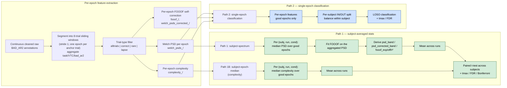

# Analysis workflow

This document describes the two parallel analysis paths and the rules that
govern epoch filtering, aggregation, and FOOOF correction. The same epoch
filter (drop `bad_ar2 == True`) and the same per-subject IN/OUT split (VTC
percentile bounds computed on **all** epochs, applied after the filter)
are used everywhere — only the aggregation step differs between paths.

For the upstream filter mechanics, see
[`docs/preprocessing_workflow.md`](preprocessing_workflow.md). The bad-channel
interpolation that happens *during* preprocessing eliminates the trial-level
INTERP category that previously needed a second filter here.

## Terminology: trials vs. epochs

The pipeline distinguishes two units of data:

- **Trial**: one stimulus presentation in the gradCPT stream (~0.852 s,
  `tmin=0.426` to `tmax=1.278` around the event onset). This is the unit
  the BIDS events table and the `bad_ar2` annotations operate on.
- **Epoch**: the unit fed to feature extraction. Controlled by
  `--n-events-window=N`:
  - `N=1` (legacy single-trial mode): 1 epoch = 1 trial.
  - `N=8` (cc_saflow default): each epoch is a **sliding window of 8
    consecutive trials**, stride 1, ending on the current trial. So an
    epoch spans ~6.8 s and an N-trial run yields ~N−7 epochs.

Per-epoch metadata aggregates the constituent trials:
`included_task` / `included_VTC` / `included_bad_ar2` keep the length-N
per-trial arrays, and scalar fields aggregate them — `window_vtc_mean`
for the VTC, `window_any_bad` (OR across trials) for the bad flag, and
per-task counts (`window_n_cc` / `co` / `ce` / `oe`). The downstream
`bad_ar2` field is set from `window_any_bad`, so an 8-trial epoch is
"bad" as soon as **any** of its 8 trials overlaps a `BAD_*` annotation.

Once the windowing step has happened, the rest of this document calls
the unit an **epoch**. The word "trial" is reserved for the underlying
stimulus presentations that an epoch is built from.

## Two-path overview



## 8-trial windowing and trial-type filter

The windowing step (`code.features.utils.segment_continuous_data` +
`select_window_mask`) takes the continuous cleaned raw and produces
the per-epoch arrays that feed every feature extractor. It does both
the segmentation and the windowing in a single pass:

1. **Segment into sliding windows.** For each stimulus event `i`, the
   epoch covers the trials `[i-N+1 … i]` (so `--n-events-window=8`
   builds epochs that end on every trial from the 8th onward; the
   first 7 trials of a run have no full window and are dropped).
   Stride is 1 trial. The first `N-1` trials of each run never anchor
   an epoch, and `N=1` collapses this back to plain per-trial
   segmentation.
   - Continuous data is sliced over the full window span, giving
     `(n_epochs, n_spatial, n_samples_per_epoch)` with
     `n_samples_per_epoch = (tmax − tmin) · sfreq · N`.
   - Metadata is aggregated: `window_any_bad` ORs the per-trial
     `bad_ar2`, `window_vtc_mean` averages the per-trial VTC, and the
     `included_task` array is kept so the trial-type filter below can
     inspect the actual outcomes inside the window.

2. **Trial-type filter** (`--trial-type`, mirrors `cc_saflow`'s
   `select_epoch`). Operates on `included_task`:
   - `alltrials`: keep every epoch (no filter).
   - `correct`: every constituent trial is `correct_commission` *or*
     `correct_omission` (the entire 8-trial window is error-free).
   - `lapse`: at least one constituent trial is `commission_error`
     (the window contains a lapse).
   - `rare`: at least one constituent trial is `correct_omission` *or*
     `commission_error` (the window contains a rare-stim outcome).
   - `correct_commission`: strictest — every constituent trial is
     `correct_commission`.

The trial-type filter selects which set of epochs survives into PSD /
FOOOF / complexity, and downstream stats/classification load whichever
`_type-<...>` variant they were asked for. Epochs that survive the
trial-type filter but have `window_any_bad == True` are kept in the file
and dropped later by the analysis-level `bad_ar2` filter (so the same
features file can be reused for `--keep-bad-trials` runs).

## VTC IN/OUT zoning (where the percentile cut happens)

The IN/OUT/MID label that drives every IN-vs-OUT contrast is a property
of the **epoch**, not of the trials that make it up — this matches
`cc_saflow`'s actual behavior (see `cc_saflow/saflow/data.py:get_VTC_bounds`
and `get_inout`) and is the canonical implementation in saflow.

Concretely:

1. **Per-trial VTC** is computed once at BIDS-conversion time
   (`compute_VTC` in `code/utils/behavioral.py`, from per-trial RTs and
   a Gaussian smoothing kernel) and stored in `events.tsv` as
   `VTC_filtered`. There is one VTC value per stimulus trial.
2. **Window aggregation.** When the 8-trial sliding windows are built,
   each epoch records its 8 constituent per-trial VTCs in
   `included_VTC`, and the scalar `window_vtc_mean = mean(included_VTC)`
   is also stored.
3. **Percentile cut over window-mean VTCs.** At analysis time the
   classification/stats loaders take a subject's array of
   `window_vtc_mean` values and compute the 25th and 75th percentile
   across **those window-level means** (per-subject by default; per-run
   with `--zoning=per-run`, again matching `cc_saflow`).
4. **Per-window label.** Each window is then assigned IN / OUT / MID
   directly from its own `window_vtc_mean` against the percentile
   bounds — `IN` if ≤ 25th, `OUT` if ≥ 75th, otherwise `MID`. There is
   never a window that mixes IN and OUT trials because the IN/OUT label
   is computed per-window from the start; the per-trial array is kept
   for transparency but is not consumed by the selection logic.

What this is *not*: we do **not** compute the 25/75 cut on per-trial
VTCs and then aggregate per-trial labels into a window label
(all-IN/all-OUT/majority). Such an approach is a possible alternative
but would diverge from cc_saflow and is not implemented.

> If you change `--n-events-window`, the percentile cut shifts: the
> sliding-window mean is a low-pass filter on the per-trial VTC, so
> with `N=8` the distribution of window-mean VTCs is tighter than the
> raw per-trial distribution and the same nominal `[25, 75]` bounds
> select a different set of trials than they would in single-trial
> (`N=1`) mode. This is by design (it's what cc_saflow does and what
> the analyses are calibrated against), but it's worth knowing.

## Path 1 — subject-averaged stats (default for stats)

Used for: `psd_<band>`, `psd_corrected_<band>`, `fooof_exponent`,
`fooof_offset`, `fooof_r_squared`, complexity metrics.

Aggregation (PSD-derived families):

1. **Per `(subject, run, condition)`** — keep only good epochs; compute
   the **median** PSD across them.
2. **FOOOF fit** on that median PSD (one fit per channel, per
   `(subject, run, condition)`).
3. Derive the requested feature:
   - `psd_<band>`: average the median PSD over the band's frequencies.
   - `psd_corrected_<band>`: subtract the aperiodic fit from the median
     PSD in log-space, then average over the band.
   - `fooof_exponent` / `_offset` / `_r_squared`: read directly off the fit.
4. **Mean across runs** of those per-`(subj, run, cond)` values → one
   value per `(subject, condition)` per channel.
5. **Paired t-test** across subjects (OUT − IN). Multiple-comparison
   correction via tmax (default), FDR or Bonferroni; tmax permutation
   uses the same paired diffs as the test stat (FWER-correct).

Aggregation (complexity): identical except no FOOOF fit — features are
already per-epoch scalars. Use `--analysis-mode subject-trial-median`.

Why this path: per-epoch FOOOF fits on short windows are noisy (the
single-trial 0.852 s mode gives alpha ~4 frequency bins; the 8-trial
window improves things but per-(subj, run) aggregation is still
cleaner). Fitting on a run-averaged spectrum gives a much better
aperiodic estimate. Within a subject, IN and OUT are corrected by
*different* aperiodic baselines — this is by design, and it isolates
the periodic IN/OUT effect from any IN/OUT difference in the 1/f
baseline.

> Caveat: because the aperiodic fit depends on the epoch's condition,
> `psd_corrected_*` from Path 1 carries condition information by
> construction. Don't feed it to a classifier — it would learn the label
> via the correction itself rather than the underlying neural signal.
> Path 2 features are leakage-free.

## Path 2 — single-epoch classification (default for classification)

Used for: `psd_<band>`, `psd_corrected_<band>` (per-epoch self-corrected),
`fooof_exponent` / `_offset` / `_r_squared` (per-epoch fits), complexity
metrics. Each feature is already at epoch granularity from the
extraction step — the loader just filters good epochs and forwards them.

Mechanics:

1. Drop epochs with `bad_ar2 == True` (i.e. epochs whose
   `window_any_bad` is True).
2. Per-subject VTC percentile cuts on `window_vtc_mean` across all
   epochs → IN / OUT / MID labels (see "VTC IN/OUT zoning" above);
   MID dropped, IN/OUT kept.
3. Balance IN vs OUT counts within subject (default; `--no-balance` to
   skip).
4. Leave-one-subject-out cross-validation (default), with permutation-
   based significance testing across spatial units.

Per-epoch corrected PSDs are produced by self-correction in
`compute_fooof.py` (each epoch subtracts its *own* aperiodic), so they
do not leak the condition label and are safe to classify on.

## What feeds what

| Feature folder | Path 1 reads | Path 2 reads |
|---|---|---|
| `welch_psds_<space>/` | yes — re-aggregates and re-fits | yes — band mean per epoch |
| `welch_psds_corrected_<space>/` | no — recomputes corrected PSDs from welch | yes — per-epoch self-corrected |
| `fooof_<space>/` | no — refits aperiodic on aggregated spectrum | yes — per-epoch aperiodic params |
| `complexity_<space>/` | yes (subject-trial-median sub-mode) | yes |

Path 1 only ever needs raw welch PSDs for the PSD/FOOOF families. The
precomputed `welch_psds_corrected_<space>/` and `fooof_<space>/` folders
exist for Path 2 and don't need to be regenerated when changing
`inout_bounds` or the FOOOF config.

Feature files are written per `(--space, --n-events-window, --trial-type)`
triplet, with the windowing token in the `desc` suffix (`welch` for
single-trial, `welchw8` for 8-trial windows) and the trial-type filter
in the `_type-<...>` token of the filename. So a sensor-space, 8-trial,
`correct`-filtered Welch run lands under
`welch_psds_sensor/sub-XX/sub-XX_..._desc-welchw8_psds.npz` with
`type-correct` recorded in metadata.

## Epoch filter, IN/OUT split

Same rule for both paths:

- **VTC percentile thresholds** (`config.analysis.inout_bounds`, default
  `[25, 75]`): computed per subject over the array of `window_vtc_mean`
  values for **all** epochs, including those flagged `bad_ar2`. This
  anchors the percentile cut to the full distribution and accepts a
  small class imbalance after the bad filter. See "VTC IN/OUT zoning"
  above for the full rule.
- **Bad-epoch filter**: drop `bad_ar2 == True` (i.e. `window_any_bad`)
  after IN/OUT masking. Default on; `--keep-bad-trials` flips it.
- **Trial-type filter**: already applied at feature-extraction time via
  `--trial-type` (see "8-trial windowing and trial-type filter" above);
  analysis tasks pick the matching `_type-<...>` file.
- **MID zone**: epochs whose `window_vtc_mean` sits between the cuts
  are excluded from IN-vs-OUT comparisons.

## Provenance per analysis run

Every `*_results.npz` carries a sibling `*_metadata.json` with:

- `analysis_mode`: `subject-spectrum` / `subject-trial-median` / `single-trials`.
- `aggregate`: per-subject statistic for sub-mode (`median` / `mean`).
- `test`: `paired_ttest` or `independent_ttest` or `ttest_ind` (legacy).
- `drop_bad_trials`, `bad_ar2_metadata_present`, `n_bad_excluded`.
- `inout_bounds`, `n_subjects`, `n_in`, `n_out`.
- `per_subject`: `{sub-XX: {n_total, n_in, n_out, n_mid, n_bad_in, n_bad_out, ...}}`.
- `fooof_freq_range`, `fooof_params` (Path 1 only).
- Provenance: git hash of stats script, hash of script file, git hashes
  of every input feature file consumed.

The output filename includes a `path-<mode>` tag, so Path 1 and Path 2
results for the same feature_type land in different files.

## CLI

`analysis.stats` and `analysis.classify` share the same `--features` interface.

`--features` accepts:
- a single feature name (`fooof_exponent`, `psd_alpha`, `complexity_lzc_median`, ...)
- a space-separated list (`"fooof_exponent psd_alpha"`)
- a shortcut: `psds`, `psds_corrected`, `fooof`, `complexity`, or `all`
  (where `all` = FOOOF + PSD + PSD-corrected + complexity)

By default each feature is processed independently (single-feature framework).

### Stats — Path 1 (subject-averaged, default)

Single feature:
```
invoke analysis.stats --features=fooof_exponent
```

A whole family:
```
invoke analysis.stats --features=psds
invoke analysis.stats --features=psds_corrected --space=schaefer_400
invoke analysis.stats --features=fooof
invoke analysis.stats --features=complexity
```

Every feature on disk (single-feature framework — each tested independently):
```
invoke analysis.stats --features=all
invoke analysis.stats --features=all --space=schaefer_400 --n-jobs=4
```

Mixed list:
```
invoke analysis.stats --features="psd_alpha psd_corrected_alpha fooof_exponent"
```

Switch to Path 2 (per-epoch independent t-test):
```
invoke analysis.stats --features=psds --analysis-level=epoch
```

### Classification (Path 2, default)

Single feature:
```
invoke analysis.classify --features=fooof_exponent --clf=lda
```

A whole family — one classification per feature:
```
invoke analysis.classify --features=psds
```

Every feature, each classified independently (single-feature framework):
```
invoke analysis.classify --features=all --space=schaefer_400
```

Combine all complexity metrics into one model with feature importances:
```
invoke analysis.classify --features=complexity --space=schaefer_400 \
    --clf=rf --combine-features --importances
```

Fan out to SLURM — one job per feature:
```
invoke analysis.classify --features=all --slurm
```

### Underlying scripts

The invoke tasks shell out to the scripts below; you can call them directly if you need flags not exposed at the invoke layer (e.g. `--keep-bad-trials`):

```
python -m code.statistics.run_group_statistics --feature-type <name(s)> ...
python -m code.classification.run_classification --feature <name(s)> ...
```

Both default to dropping `bad_ar2` epochs (which, in 8-trial windowed
mode, are epochs whose `window_any_bad` is True — i.e. at least one
constituent trial was flagged by AR2). Pass `--keep-bad-trials` to
disable.
