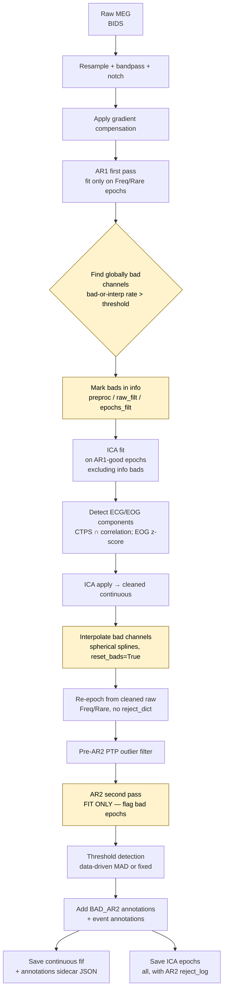

# Preprocessing workflow

This document describes the per-run preprocessing pipeline implemented by
`code/preprocessing/run_preprocessing.py`. The design goal is to feed every
downstream analysis a continuous, ICA-cleaned recording with a single binary
trial flag (`good` vs `bad_ar2`) — no trial-level interpolation category.

## Flow



The four highlighted nodes are the changes that eliminate the trial-level
INTERP category. Old pipeline: AR2 ran in `mode="both"`, returning both a
reject_log *and* a per-channel-interpolated copy of the epochs — meaning
some surviving trials had channels imputed from neighbours, while the
underlying continuous file did not. The current pipeline interpolates bad
channels once on the *continuous* signal so that AR2 only ever needs to
flag whole epochs as bad.

## Outputs

Per `(subject, run)` under `derivatives/preprocessed/sub-XX/meg/`:

| File | Purpose |
|---|---|
| `*_proc-clean_meg.fif` | ICA-cleaned continuous, bad chans interpolated, BAD_AR2 annotations |
| `*_proc-clean_annotations.json` | Sidecar with onset/duration/description of every annotation; sufficient to drop bad trials downstream without reading the FIF |
| `*_proc-clean_params.json` | Provenance: filter, ICA, AR1/AR2 stats, bad channel list, retention |
| `*_proc-ica_meg.fif` | ICA-cleaned epochs (all of them, with the AR2 reject_log) |
| `*_desc-ARlog1_meg.pkl` | AR1 reject_log (used to derive globally bad channels) |
| `*_desc-ARlog2_meg.pkl` | AR2 reject_log (per-trial bad flag only — no interp labels under fit-only mode) |
| `*_desc-ica_meg-ica.fif` | Fitted ICA object |
| `*_desc-report_meg.html` | Human-readable run report |

The previous `*_proc-ar2interp_meg.fif` output is no longer produced.

## Configuration

`config.yaml` sections that drive this pipeline:

```yaml
preprocessing:
  filter: {lowcut, highcut, notch}
  ica:
    n_components, ecg_ctps_threshold, ecg_corr_threshold, eog_threshold
  bad_channels:
    enabled: true
    threshold: 0.30           # AR1 bad-or-interp rate at which a channel is flagged
  pre_ar2_filter:
    enabled: true
    ptp_multiplier: 10        # drop epochs > 10x median PTP before AR2
  autoreject:
    n_interpolate, consensus
    second_pass_mode: fit_only
```

## Trial-status downstream

Comparative analyses (stats, classification) read `trial_metadata['bad_ar2']`
written by the segmenter at feature-extraction time. The flag is computed
by intersecting each trial's epoch window with the BAD_AR2 annotations in
the cleaned-raw file (or, equivalently, the JSON sidecar). The default
behaviour everywhere is to drop trials with `bad_ar2 == True`.

There is intentionally no `interp_ar2` category — channel interpolation
happens on the continuous signal, before any trial is extracted, so every
surviving trial has a uniform channel layout.
